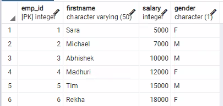
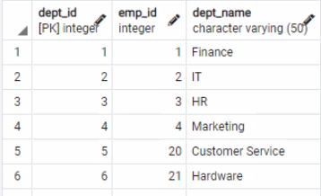
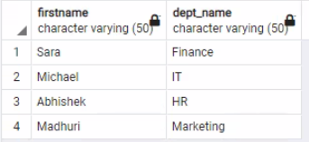
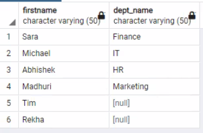
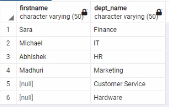
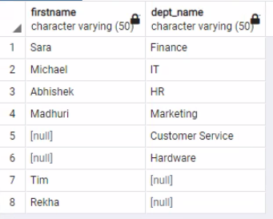
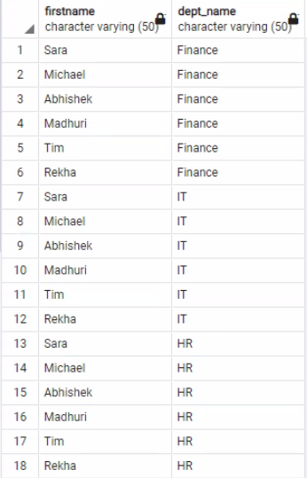
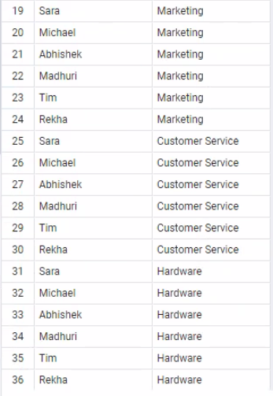

# Joins in Postgre SQL

Join is used to combine data or rows from one or more tables based on a common field between them. These common fields are generally the Primary key of the first table and Foreign key of other tables.

**There are 5 types of joins in PostgreSQL:-**

1.Inner Join

2.Left Join

3.Right Join

4.Full Outer Join

5.Cross Join

**Here is how you  create the table :-**

**Employee Table:-**

```
create table employee
( emp_ID int primary key
, FirstName varchar(50) not null
, SALARY int
,Gender char(1)
);
```

**Here is how you insert the into the table:-**

```
Insert into employee values(1,'Sara',5000,'F');
Insert into employee values(2,'Michael',7000,'M');
Insert into employee values(3,'Abhishek',10000,'M');
Insert into employee values(4,'Madhuri',12000,'F');
Insert into employee values(5,'Tim',15000,'M');
Insert into employee values(6,'Rekha',18000,'F');
```

**Department Table :-**

```
create table department
( dept_id int primary key,
  emp_id int ,
  DEPT_NAME varchar(50)
);
```

**Here is how you insert the into the table:-**

```
Insert into department values(1,1,'Finance');
Insert into department values(2,2,'IT');
Insert into department values(3,3,'HR');
Insert into department values(4,4,'Marketing');
Insert into department values(5,20,'Customer Service');
Insert into department values(6,21,'Hardware');
```


**INNER JOIN:-**

JOIN (or explicitly INNER JOIN ) returns rows that have matching values in both
tables.


**Here is an employee table:-**





**Here is the department table:-**





**Example:-**

```
SELECT employee.Firstname, department.dept_name
FROM employee
INNER JOIN department
ON employee.emp_id = department.emp_id;
```




**LEFT JOIN:-**


LEFT JOIN returns all rows from the left table with corresponding rows from the right
table. If there's no matching row, NULL s are returned as values from the second
table.


**Example:-**

```
select employee.FirstName , department.dept_name
from employee
left join department
on employee.emp_id=department.emp_id;
```




**RIGHT JOIN:-**

RIGHT JOIN returns all rows from the right table with corresponding rows from the
left table. If there's no matching row, NULL s are returned as values from the left
table.

**Example :-**

```
SELECT city.name, country.name
FROM city
CROSS JOIN country;
SELECT city.name, country.name
FROM city, country;
```




**FULL JOIN:-**

FULL JOIN (or explicitly FULL OUTER JOIN ) returns all rows from both tables – if
there's no matching row in the second table, NULL s are returned.


**Example:-**

```
select employee.FirstName , department.dept_name
from employee
full outer join department
on employee.emp_id=department.emp_id;
```





**CROSS JOIN:-**

CROSS JOIN returns all possible combinations of rows from both tables. There are
two syntaxes available.

**Example:-**

```
select employee.FirstName , department.dept_name
from employee
cross join  department;
```






