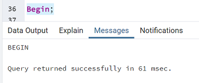
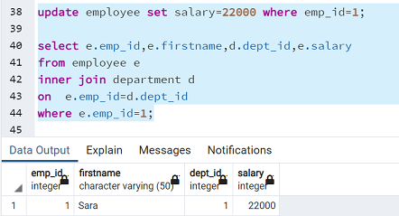
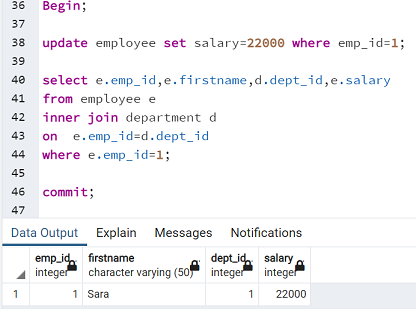

# PostgreSQL Transactions
                                                 
This blog is about "How to handle PostgreSQL transactions using the BEGIN, COMMIT, and ROLLBACK statements".

BEGIN command is used to initiate a transaction. A transaction is nothing but a unit of work done in the database, the work can be anything from creating tables to deleting them. BEGIN command should be the first word of a transaction.

Syntax :
BEGIN TRANSACTION;  (or) BEGIN WORK; (or simply) BEGIN;

By default, PostgreSQL transactions are auto-commit, but to end the transaction block we need to give either COMMIT or ROLLBACK commands. Statements inside the transaction block execute faster than normally given because the CPU uses special disk computation for defining transactions.

Syntax:
COMMIT WORK; (or) COMMIT TRANSACTION; (or simply) COMMIT;

Syntax:
ROLLBACK WORK; or ROLLBACK TRANSACTION; or in short ROLLBACK;

Let’s create a new table named EMPLOYEE and DEPARTMENT

**Employee Table:-**

~~~
create table employee
( emp_ID int primary key
, FirstName varchar(50) not null
, SALARY int
,Gender char(1)
);
~~~
**Here is how you insert the into the table:-**
~~~
Insert into employee values(1,'Sara',5000,'F');
Insert into employee values(2,'Michael',7000,'M');
Insert into employee values(3,'Abhishek',10000,'M');
Insert into employee values(4,'Madhuri',12000,'F');
Insert into employee values(5,'Tim',15000,'M');
Insert into employee values(6,'Rekha',18000,'F');
Department Table :-
~~~
**Create Table Department**
~~~
( dept_id int primary key,
  emp_id int ,
  DEPT_NAME varchar(50)
);
~~~

**Here is how you insert the into the table:-**

~~~
Insert into department values(1,1,'Finance');
Insert into department values(2,2,'IT');
Insert into department values(3,3,'HR');
Insert into department values(4,4,'Marketing');
Insert into department values(5,20,'Customer Service');
Insert into department values(6,21,'Hardware');
~~~

**Let's see an example** 

In the below example , the transaction will Update Employee Salary and Select the data.

~~~
Begin;
							
update employee set salary=22000 where emp_id=1;
							
select e.emp_id,d.dept_id,e.salary
from employee e
inner join department d
on e.emp_id=d.dept_id
where e.emp_id=1;

Commit;
~~~

Steps to execute the transaction above,

**Step 1:**

**Step 2:**

**Step 3:**

After executing the COMMIT statement, PostgreSQL also guarantees that the change will be durable.

In the below example , Rollback will undo the change of current transaction. 

This is how the transaction block works using BEGIN , COMMIT , ROLLBACK. 

