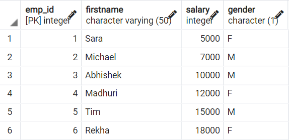
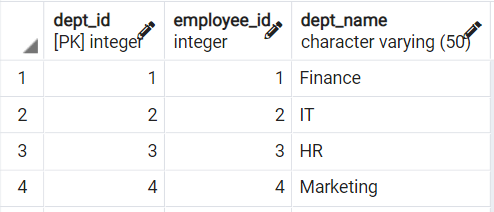
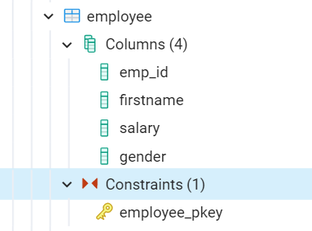
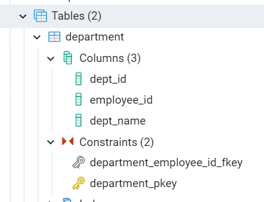
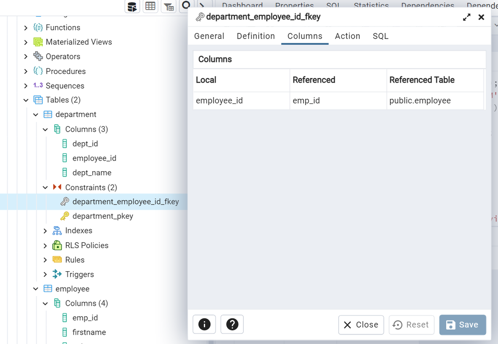
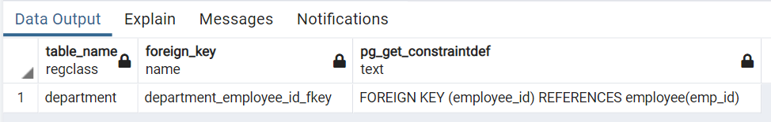
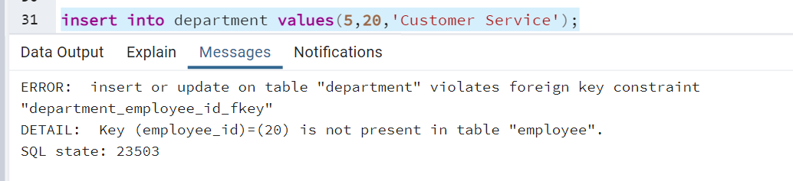

# Relationship between foreign key and primary key

How do a foreign key(FK) and a primary key(PK) relate to each other?

1. Let us start by creating 2 tables: An `employee` table and a `department` table.

**Let us create the `employee` table:**

```
create table employee
( emp_id int primary key,
  firstname varchar(50) not null,
  salary int,
  gender char(1)
);
```

Let us add some data to the `employee` table by running the following queries:

```
insert into employee values(1,'Sara',5000,'F');
insert into employee values(2,'Michael',7000,'M');
insert into employee values(3,'Abhishek',10000,'M');
insert into employee values(4,'Madhuri',12000,'F');
insert into employee values(5,'Tim',15000,'M');
insert into employee values(6,'Rekha',18000,'F');
```

`select * from employee;` :



**Let us create the `department` table:**

```
create table department
( dept_id int primary key,
  employee_id int references employee(emp_id) ,
  dept_name varchar(50)
);
```

Let us add some data to the `department` table by running the following queries:

```
insert into department values(1,1,'Finance');
insert into department values(2,2,'IT');
insert into department values(3,3,'HR');
insert into department values(4,4,'Marketing');
```

`select * from department;` gives:



2. Table `employee` has primary key(PK) `emp_id`:



3. Table `department` has primary key(PK) `dept_id` and foreign key(FK) `employee_id`.

To see this go to this Database -> Schemas -> Public -> Tables -> department and expand constraints:



4. Note that `department.employee_id` actually references `employee.emp_id`. It has been renamed from `emp_id` in employee table to `employee_id` in department table.

From the Constraints in Step 3, right click on `department_employee_id_fkey` :



5. Right click and select "Properties":


6. Select "Columns" in the tab to see the relationship between the FK in `department` and in the `employee` table that it references:


7. `employee` is the parent table. `emp_id` is the PK in that table. `department` is the child table. `employee.emp_id` here(called `employee_id`) is the FK.

8. The name of the FK can be the same name as in the parent table, or it could be a different name. In our case it has a different name.

9. Query to show all foreign keys in a database in PostgreSQL:

```
--Query to show all foreign keys fk in database
SELECT conrelid::regclass AS table_name,
       conname AS foreign_key,
       pg_get_constraintdef(oid)
FROM   pg_constraint
WHERE  contype = 'f'
AND    connamespace = 'public'::regnamespace
ORDER  BY conrelid::regclass::text, contype DESC;
```

Running this query gives us:



10. Now, just for kicks, if we try to create a record in `department` for an employee that doesn't exist, we will get an error:

```
insert into department values(5,20,'Customer Service');
```

Output:


Why do we get this error? We're trying to insert `employee_id` 20 into the `department` table, but that id doesn't exist in the `employee` table.

I hope this gave you a good idea about how primary keys and foreign keys work.
