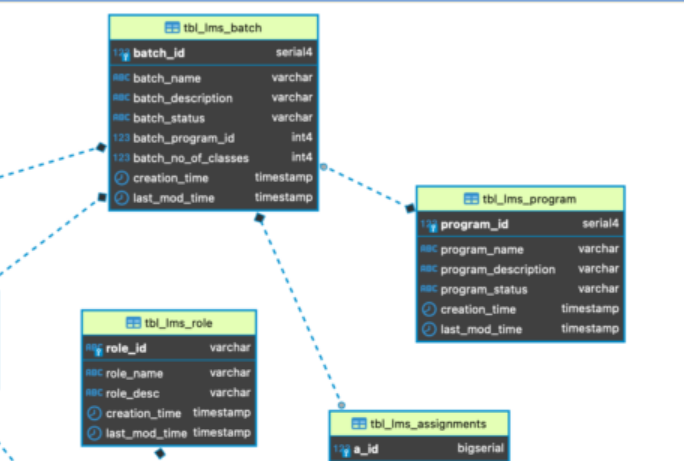
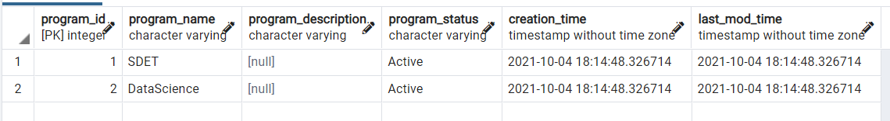
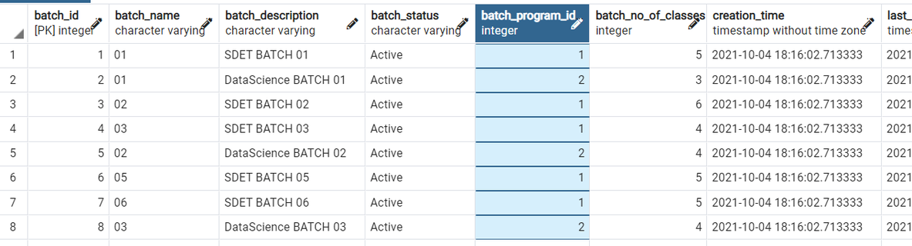
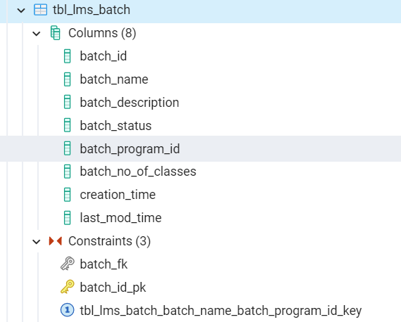
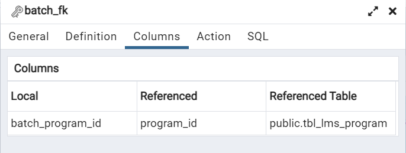
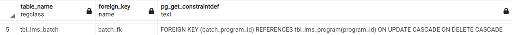

# Relationship between foreign key and primary key

How do a foreign key(FK) and a primary key(PK) relate to each other?

1. Here is a snippet of 2 tables, `tbl_lms_program` and `tbl_lms_batch` from the Entity-Relationship Diagram:



2. _tbl_lms_program_ has primary key(PK) `program_id`:

`select * from tbl_lms_program;`



3. _tbl_lms_batch_ has PK `batch_id`, and wants to reference the PK `program_id` from _tbl_lms_program_. This is created as a foreign key (FK) in _tbl_lms_batch_. It can be named `program_id` or any other name, in our case it is called `batch_program_id`. This would be a FK in this table as it is a PK in another table.

`select * from tbl_lms_batch;`



4. _tbl_lms_program_ is the parent table. `program_id` here is the PK. _tbl_lms_batch_ is the child table. `program_id` here(called `batch_program_id`) is the FK.

5. The name of the FK can be the same name as in the parent table, or it could be a different name.

6. If you want to see the foreign key mapping in tbl_lms_batch: in pgadmin4 expand this table



- See Constraints --> `batch_fk`
- Right click on it. Go to Properties and Columns, it will show the PK <-> FK relationship.



We see here that `tbl_lms_program.program_id` is called **batch_program_id** in `tbl_lms_batch`. **`batch_program_id` is a FK**.

7. Query to show all foreign keys in a database in PostgreSQL:

```
--Query to show all foreign keys fk in database
SELECT conrelid::regclass AS table_name,
       conname AS foreign_key,
       pg_get_constraintdef(oid)
FROM   pg_constraint
WHERE  contype = 'f'
AND    connamespace = 'public'::regnamespace
ORDER  BY conrelid::regclass::text, contype DESC;
```

8. Here is a snippet from the above query showing the details of _tbl_lms_batch_:


