# Views in PostgreSQL

1. Let us start by creating 2 tables: An `employee` table and a `department` table.

**Let us create the `employee` table:**

```
create table employee
( emp_id int primary key,
  firstname varchar(50) not null,
  salary int,
  gender char(1)
);
```

Let us add some data to the `employee` table by running the following queries:

```
insert into employee values(1,'Sara',5000,'F');
insert into employee values(2,'Michael',7000,'M');
insert into employee values(3,'Abhishek',10000,'M');
insert into employee values(4,'Madhuri',12000,'F');
insert into employee values(5,'Tim',15000,'M');
insert into employee values(6,'Rekha',18000,'F');
```

`select * from employee;` :

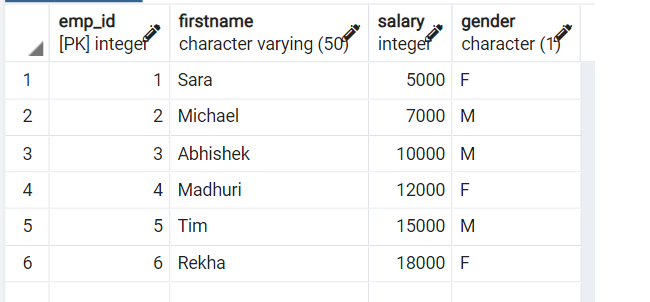

**Let us create the `department` table:**

```
create table department
( dept_id int primary key,
  employee_id int references employee(emp_id) ,
  dept_name varchar(50)
);
```

Let us add some data to the `department` table by running the following queries:

```
insert into department values(1,1,'Finance');
insert into department values(2,2,'IT');
insert into department values(3,3,'HR');
insert into department values(4,4,'Marketing');
```

`select * from department;` gives:

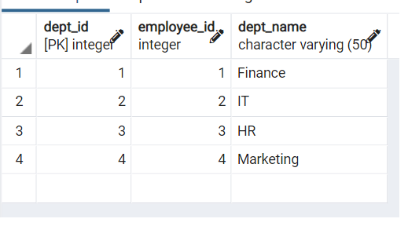

Notice that the `department` table has only 4 employees while the `employee` table has 6 employees.

2. Instead of running complex joins and selects for every query, we can create a `view` which stores the output of a combination of tables.

```
create view salary_dept as
	select e.firstname, e.salary, d.dept_name
	from employee e
	inner join department d
	on e.emp_id = d.employee_id;
```

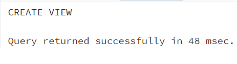

Now we can reference `salary_dept` as if it is a table.

```
select * from salary_dept;
```

This query gives us access only to the data we need. This makes it easier to query this dataset further.

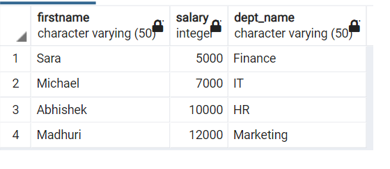

3. Now we can run a subquery with an outer query + inner query combination on this new "view".

Let us first compute an inner query:

`select avg(salary) as average_salary from salary_dept;`

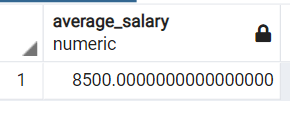

Now we need to find all the employees who earn more than the average salary. We can do this using a scalar subquery which has an outer query + an inner query within ().

The outer query is:

```select firstname, salary as high_earners
from salary_dept
where salary >= "
```

The inner query is:

```
(select avg(salary) from salary_dept)

```

Putting those 2 together we get a **"scalar subquery"**:
The average salary is 8500 and this gives us those employees who earn greater than or equal to 8500.

```
select firstname, salary as high_earners
from salary_dept
where salary >= (select avg(salary) from salary_dept);

```

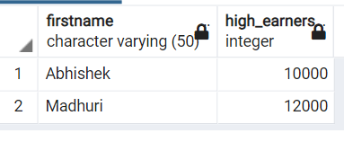

As you can see this scalar subquery now looks quite simple as we've used the **"view"** `salary_dept`.

4. We can rename a view by running the following command:

```
alter view salary_dept rename to employee_ninjas;
```

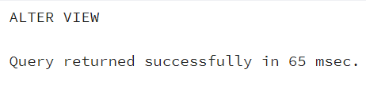

Now we can run a query on the new view:

```
select * from employee_ninjas;
```

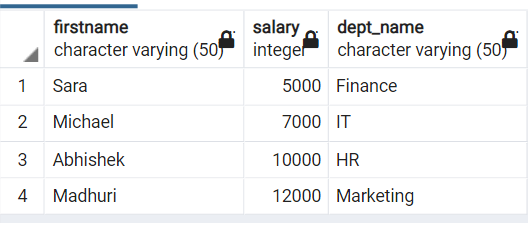

5. We can also drop a view by view name.

```
drop view if exists salary_dept;
```

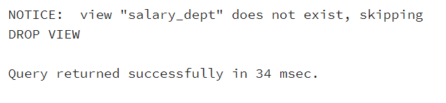

Since we deleted the `salary_dept` view we see the above error.

Now let us drop the renamed view:

```
drop view if exists employee_ninjas;
```

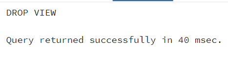

Now if we try to access the dropped view, we should get an error.

```
select * from employee_ninjas;
```

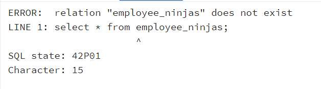

In this blog post we've seen how to CREATE a view, ALTER a view and DROP a view. Views make subqueries easier to understand.
