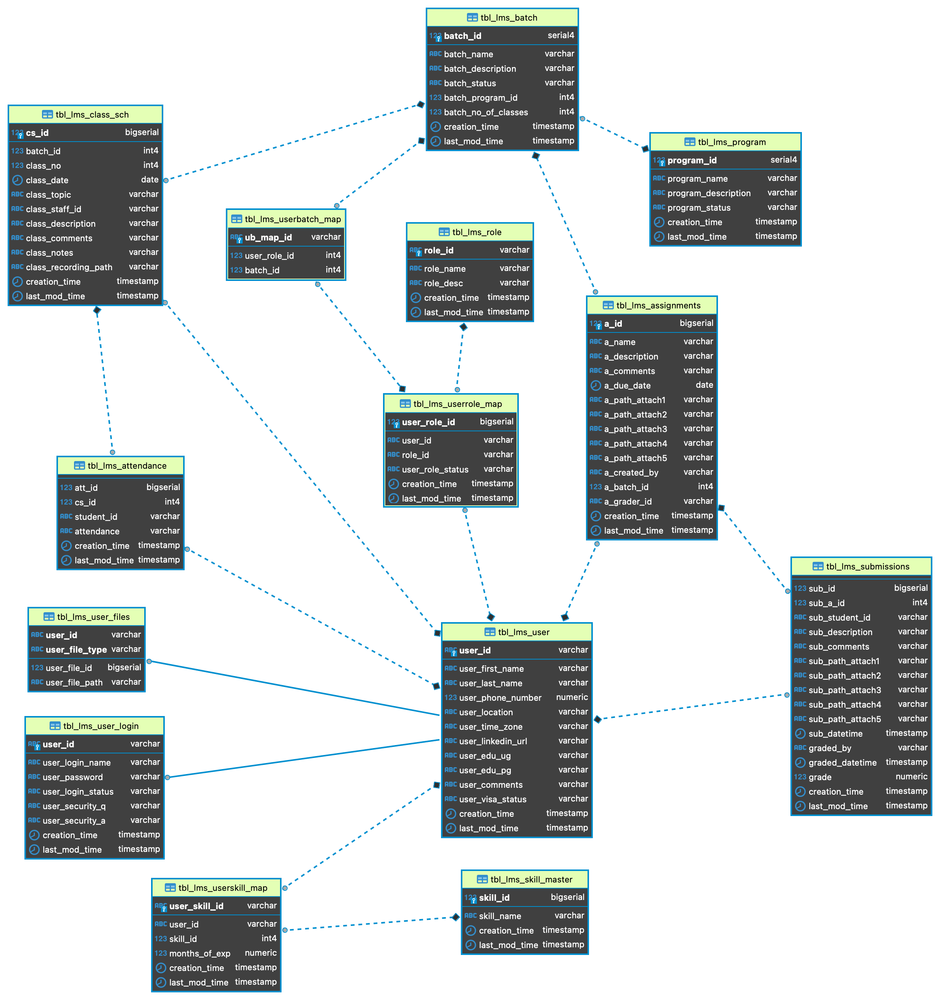

# SQL Hackathon @ Numpy Ninja

The following people participated in a SQL hackathon run by [Numpy Ninja](https://www.numpyninja.com/). Numpy Ninja is a career centric company, working on cutting edge AI technology projects.

This team is a group of Software Development Engineers In Test (SDET) who participated in this hackathon.

[Magdaline Divya](https://github.com/magdadiv)
[Pallavi Ramam](https://github.com/pramam)
[Rajalaxmi Jena](https://github.com/rajalaxmijena91)
[Sharmila Ramesh](https://github.com/RameshSharmila)
[Sridevi Chandrasekaran](https://github.com/Sri-Sundar)

This website documents what we did and what we learned.

## Overview

A PostgreSQL database schema consisting of 14 tables with some populated data was given to us. This database(Learning Management System-DB, LMS_DB) is modeled on how Numpy Ninja runs-- It has programs for Data Science/Machine Learning, and SDETs, with batches of professionals in each program.

Take a look at the Entity Relationship Diagram (ER-Diagram) below:

We were given 90 queries to write, as a team, in the span of **exactly** one week, from a Tuesday evening to the next Tuesday evening. Bonus points would be given for writing extra queries and following Agile Methodologies.
